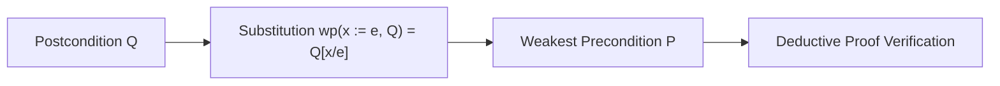

# Hoare Logic Axiomatic Verifier Skill

High-efficiency, zero-dependency Python implementation of **Axiomatic Hoare Logic and Weakest Precondition Calculus (Dijkstra's wp)**.

## Features
- **Weakest Precondition (wp)**: Synthesizes sound precondition assertions for variable assignments.
- **Hoare Triple Validation**: Evaluates partial correctness formulas \(\{P\} S \{Q\}\).
- **Zero External Dependencies**: Pure Python standard library.
- **Native MCP Protocol**: JSON-RPC 2.0 stdio server compatible with Claude Desktop, Cursor, and Windsurf.

## Architecture

